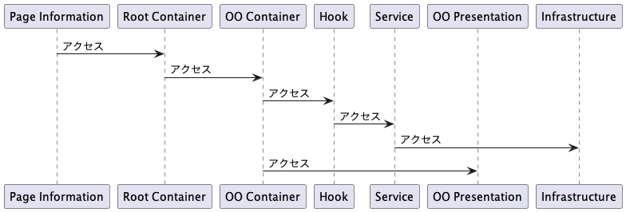

## 概要

データフローについて

## データフロー

ページの構成については上記の通りのデータフローに主に従うものとする。

- Page Information
  - 主にこれは`src/app`ディレクトリのページディレクトリをさす.ここからは1つのRootContainerを呼び出しレンダリングする
  - 主な役割はページのルーティングとなる
- RootContainer
  - 主にこれは`features/〇〇/container/RootContainer.tsx`が該当する.各種ページの`features`には必ず1つ存在するものとする
  - ここを起点とし色々な`Container`を呼び出しcomponentsを分離できる起点とする
  - 主な役割は`prefetch`や`Container`同志をまたぐ`state`の管理である。
- 〇〇Container
  - `component`を分離してのロジックを格納する場所である. 主に`useQuery`や`hook`の呼び出しを行う場所である.
- hook
  - `Container`で利用するhook. `features/〇〇/hook`にhookは格納するものとする
- service
  - serviceはAPIを呼び出すためのもの.例えば`useQuery`で使用するAPIは何度も同じコードを書ことがあるのでserviceで1つ記載しておき共通化しておく
  - また、`useMutation`なんかでは成功した後に`useQuery`を必ずしなければならない時がある。これもここのserviceの役目
  - 主な役割はAPIを呼び出す時の起点や呼び出した後のデータの変換である
- infrastructure
  - 主にサーバで実行される場所.next13になってサーバで実行させないといけないようなコードがある場合はここに記載する
  - loggingなどのコード
- (domain)
  - 図にはないが、いつか記載する。domainはロジックを記載したりtypeを記載したりするものとする.
  - 例えばloginフォームがあればそのloginのtypeだったり、validationに必要な条件を記載したりする.
